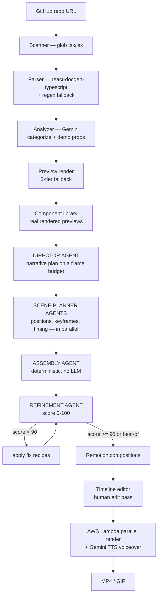
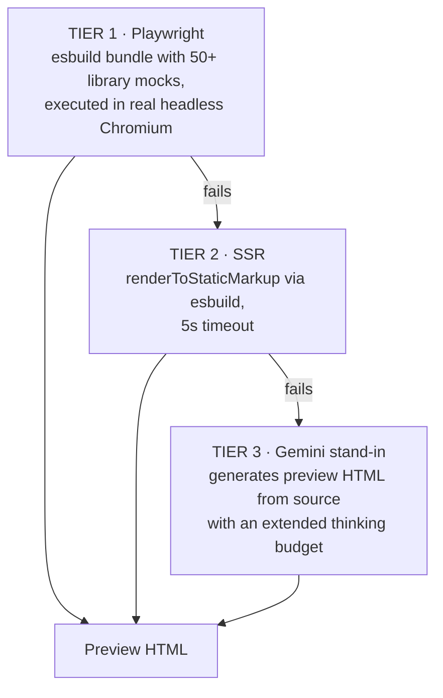

<p align="center">
  
</p>

<h1 align="center">Scenery</h1>

<p align="center">
  <strong>Point it at a React repo and it generates real product demo videos from your components —<br>narrated, animated, and self-scored until they're good.</strong>
</p>

<p align="center">
  <a href="https://scenery-gemini3.fly.dev">Live demo</a> ·
  <a href="https://devpost.com/software/scenery-ai-video-generation-from-github-repos">Devpost</a> ·
  <a href="#architecture">Architecture</a> ·
  <a href="#quickstart">Quickstart</a>
</p>

<p align="center">
  
  
  
  
  
</p>

---

## What it does

Give Scenery a GitHub URL. It clones the repo, extracts every React component with its prop types, and renders each one for real — not as a screenshot mock, but as executed UI. A multi-agent pipeline then writes a narrative, animates the components inside it, compiles the result into [Remotion](https://remotion.dev) compositions, and renders an MP4 with TTS voiceover.

The part that makes it more than a prompt chain: **nothing ships until it scores itself above 90.**

Built for the Gemini 3 Hackathon.

## The self-scoring loop

Most generative video tools hand you the first draft. Scenery treats the first draft as input. A Refinement agent grades every composition 0–100 across five weighted dimensions, and anything under the bar gets diagnosed, patched, and re-scored.

| Dimension | Weight | What it checks |
|---|---|---|
| Visual composition | 30% | Positioning, hierarchy, overlapping elements |
| Timing | 25% | Minimum 90 frames on screen, transition pacing |
| Narrative flow | 25% | Intro → setup → showcase → CTA structure |
| Animation quality | 15% | Spring physics, stagger, entrance duration |
| Accessibility | 5% | Text legibility, contrast |

The loop is deliberately not open-ended. The generation endpoint sets the bar at `minQualityScore: 90`, any critical issue fails the gate regardless of score, and refinement runs at most `maxRefinementIterations` passes (default 2). If no pass clears the bar it keeps the highest-scoring version rather than the last one — so refinement can never make the output worse.

```
score → below 90? → apply fix recipes → re-score → still below? → keep best version seen
```

Issues aren't returned as prose. The agent must emit `{ elementId, issue, fix, priority }` against a fixed set of fix recipes — text overlapping a component moves to `y: 0.10`, sub-10-frame entrances stretch to 15, simultaneous elements get a 12-frame stagger. That makes the fixes deterministic and machine-applicable in `applyAutoFixes()` instead of another round of hoping the model rewrites JSON correctly.

Relevant code: [`lib/ai/video-generation/refinement-agent.ts`](lib/ai/video-generation/refinement-agent.ts), [`orchestrator.ts`](lib/ai/video-generation/orchestrator.ts).

## Architecture


```mermaid
flowchart TD
    A["GitHub repo URL"] --> B["Scanner — glob tsx/jsx"]
    B --> C["Parser — react-docgen-typescript<br/>+ regex fallback"]
    C --> D["Analyzer — Gemini<br/>categorize + demo props"]
    D --> E["Preview render<br/>3-tier fallback"]
    E --> F["Component library<br/>real rendered previews"]

    F --> G["DIRECTOR AGENT<br/>narrative plan on a frame budget"]
    G --> H["SCENE PLANNER AGENTS<br/>positions, keyframes, timing — in parallel"]
    H --> I["ASSEMBLY AGENT<br/>deterministic, no LLM"]
    I --> J["REFINEMENT AGENT<br/>score 0-100"]
    J -->|"score < 90"| K["apply fix recipes"]
    K --> J
    J -->|"score >= 90 or best-of"| L["Remotion compositions"]
    L --> M["Timeline editor<br/>human edit pass"]
    M --> N["AWS Lambda parallel render<br/>+ Gemini TTS voiceover"]
    N --> O["MP4 / GIF"]
```

**Agents.** The Director plans structure against a hard frame budget (`durationSeconds × 30`, split roughly 15/15/55/15 across hook, setup, showcase, CTA) via function calling. Scene Planners run in parallel, one per scene, emitting element positions and keyframes relative to each element's own entrance rather than to video start. Assembly is intentionally **not** an LLM — it rescales bad keyframes, normalizes formats, orders tracks by z-index, and validates the composition in plain TypeScript, because that work has a right answer and shouldn't be sampled.

**Structured output everywhere.** Every Gemini call goes out with `responseMimeType: 'application/json'` and a `responseSchema` derived from a Zod schema; on validation failure the Zod error is appended to the prompt and retried ([`safe-generate.ts`](lib/ai/video-generation/safe-generate.ts)). No regex-parsing of model prose.

### Preview rendering: three tiers

Component previews are the foundation — if the preview is wrong, every downstream frame is wrong. So rendering degrades instead of failing:


```mermaid
flowchart TD
    T1["TIER 1 · Playwright<br/>esbuild bundle with 50+ library mocks,<br/>executed in real headless Chromium"] -->|fails| T2
    T2["TIER 2 · SSR<br/>renderToStaticMarkup via esbuild,<br/>5s timeout"] -->|fails| T3
    T3["TIER 3 · Gemini stand-in<br/>generates preview HTML from source<br/>with an extended thinking budget"]
    T1 --> OK["Preview HTML"]
    T2 --> OK
    T3 --> OK
```

Ahead of that, a pattern bank in [`ssr-preview.ts`](lib/component-discovery/ssr-preview.ts) detects components that can't run in a browser at all — async server components, Prisma/Drizzle/Mongoose imports, `next/headers`, `fs`, auth SDKs — and has Gemini transform them into client-safe equivalents first. Repeated render failures escalate through progressive simplification (fix props → simplify → minimal → skip) in [`render-recovery.ts`](lib/component-discovery/render-recovery.ts) so one pathological component can't stall a scan.

## Quickstart

**Prerequisites:** Node 20+, a Supabase project, a Gemini API key.

```bash
git clone https://github.com/Arty2001/scenery-gemini3-hackathon.git
cd scenery-gemini3-hackathon

npm install                 # .npmrc sets legacy-peer-deps; without it npm ERESOLVEs on @autoform

cp .env.example .env.local  # fill in Supabase URL + anon key, GEMINI_API_KEY

# apply the schema: paste supabase/migrations/*.sql into the Supabase SQL editor,
# or, with the Supabase CLI linked to your project:
supabase db push

npm run dev                 # http://localhost:3000
```

Enable the GitHub provider in Supabase Auth before signing in — the callback URL and OAuth app steps are spelled out at the bottom of [`.env.example`](.env.example).

Without a Playwright worker or Remotion Lambda configured, the app still runs: previews fall through to the SSR and AI tiers, and rendering stays local.

| Script | What it does |
|---|---|
| `npm run dev` | Dev server |
| `npm run build` | Production build |
| `npm run lint` | ESLint |
| `npm run deploy:remotion` | Publish the Remotion bundle for Lambda rendering |

### Environment variables

Full annotated list with setup notes lives in [`.env.example`](.env.example).

| Variable | Required | Purpose |
|---|---|---|
| `NEXT_PUBLIC_SUPABASE_URL` | yes | Supabase project URL |
| `NEXT_PUBLIC_SUPABASE_ANON_KEY` | yes | Supabase publishable anon key |
| `GEMINI_API_KEY` | yes | All Gemini calls — analysis, agents, TTS |
| `NEXT_PUBLIC_SITE_URL` | no | Metadata/OG base URL |
| `REPOS_BASE_DIR` | no | Where repos are cloned. Defaults to the OS temp dir |
| `PLAYWRIGHT_WORKER_URL` | no | Enables tier-1 browser previews |
| `PLAYWRIGHT_WORKER_SECRET` | no | Bearer token shared with the worker's `WORKER_SECRET` |
| `REMOTION_AWS_REGION` | no | Lambda rendering region |
| `REMOTION_LAMBDA_FUNCTION_NAME` | no | Deployed Remotion Lambda function |
| `REMOTION_SERVE_URL` | no | S3 URL of the deployed Remotion bundle |

## Heads up: the models are deprecated

This was built during the Gemini 3 hackathon against preview model IDs that Google has since retired. Cloned as-is, the API calls will fail. Swapping them is a one-file change:

| Where | Current ID | Swap to |
|---|---|---|
| [`lib/ai/models.ts`](lib/ai/models.ts) | `gemini-3-pro-preview` | Current Gemini Pro model ID |
| [`lib/ai/models.ts`](lib/ai/models.ts) | `gemini-3-flash-preview` | Current Gemini Flash model ID |
| [`lib/ai/models.ts`](lib/ai/models.ts) | `gemini-2.5-flash-preview-tts` | Current Gemini TTS model ID |
| [`app/api/ai/process-html/route.ts`](app/api/ai/process-html/route.ts), [`lib/component-discovery/render-recovery.ts`](lib/component-discovery/render-recovery.ts) | `gemini-2.0-flash` | Current fast model ID |

`GeminiModelId` is a literal union in `lib/ai/models.ts`, so TypeScript will point at every remaining call site once you edit it. Two caveats: the model column in the `projects` table stores the ID as text, so existing rows need updating too, and `thinkingConfig` / `responseModalities` support varies by model — check the current [Gemini API docs](https://ai.google.dev/gemini-api/docs/models) before assuming a drop-in replacement.

That deprecation is why this is open source rather than a maintained product. The pipeline design, not the model IDs, is the interesting part.

## Stack

| Layer | Choice | Why |
|---|---|---|
| AI | Gemini 3 Pro / Flash, Gemini TTS | Structured output, function calling, native audio |
| App | Next.js 16, React 19 | App Router, server actions, streaming pipeline progress |
| Video | Remotion 4 | Video as React — spring physics, deterministic frames |
| Rendering | Remotion Lambda | Parallel cloud render |
| Previews | Playwright, esbuild | Real browser execution, fast bundling |
| State | Zustand + Zundo | Timeline editor with undo/redo |
| Data | Supabase (Postgres, RLS) | Auth, projects, compositions, render jobs |
| UI | shadcn/ui + Radix, Tailwind | Accessible primitives |

## Project layout

```
app/
  api/ai/chat            Streaming video-generation endpoint
  api/ai/tts             Voiceover
  api/projects/[id]      Project CRUD + component discovery
  protected/…/editor     Timeline editor
lib/
  ai/video-generation/   Director · Scene Planner · Assembly · Refinement · orchestrator
  ai/tts.ts              Gemini TTS voiceover
  component-discovery/   Scanner · parser · analyzer · 3-tier preview · render recovery
  composition/           Track/item types, Zustand store, Zod schema
  remotion/              Lambda config + composition entry
  actions/               Server actions
components/remotion/     Remotion compositions, animation, transitions
playwright-worker/       Standalone Fastify + Chromium render service
supabase/migrations/     Schema
```

## Deployment

The main app and the Playwright worker deploy as two separate apps (Fly.io config included; the app is a standard Next.js standalone build and runs anywhere).

```bash
fly launch                                       # main app
fly secrets set GEMINI_API_KEY=… PLAYWRIGHT_WORKER_URL=… PLAYWRIGHT_WORKER_SECRET=…

cd playwright-worker && fly launch               # render worker
fly secrets set WORKER_SECRET=…                  # must match PLAYWRIGHT_WORKER_SECRET

npm run deploy:remotion                          # Remotion Lambda bundle
```

`NEXT_PUBLIC_*` values are inlined at build time, so they live in `fly.toml` / the Dockerfile rather than in secrets. The Supabase anon key there is a publishable key protected by row-level security, not a credential.

## Limitations

- **React only** — parsing leans on `react-docgen-typescript`. No Vue/Svelte.
- **Public repos only** — the OAuth scopes requested don't cover private repos.
- **30fps fixed** — simplifies all frame math.
- **English TTS**, voiceover only, no music tracks.
- **Single user** — no collaborative editing or composition version history.
- Complex components can still exhaust the 4-attempt render recovery and get skipped, and very large repos are slow to scan (full glob, no incremental mode).

## License

MIT — see [LICENSE](LICENSE).

<p align="center"><sub>Built by Athavan Thambimuthu for the Gemini 3 Hackathon.</sub></p>
