<h1 align="center">🎬 Scenery</h1>

<p align="center">
  <strong>AI-Powered Video Generation for React Component Libraries</strong>
</p>

<p align="center">
  <em>Transform your React components into professional product videos with AI.</em>
  <br /><br />
  <strong>7 Gemini 3 Integrations</strong> • <strong>Multi-Agent Architecture</strong> • <strong>Iterative AI Refinement</strong> • <strong>Auto-Updating Videos</strong>
</p>

<p align="center">
  <a href="https://scenery-gemini3.fly.dev"><strong>🚀 Live Demo</strong></a> •
  <a href="https://github.com/Arty2001/scenery-gemini3-hackathon"><strong>📦 Source Code</strong></a>
</p>

---

## Why Scenery is Different

### 🔄 Videos That Never Go Stale

**The Problem:** Product videos become outdated the moment you ship a new version. Traditional video editing means re-recording, re-editing, and re-exporting every time your components change.

**The Solution:** Scenery videos are **code-connected**. When your repo syncs, videos automatically update to reflect the latest component designs. Your documentation videos stay current without any manual work.


### 💬 Iterative AI Chat Refinement

**The Problem:** Most AI tools give you one shot—you get output, and if it's not quite right, you start over. The "last 10%" of refinement is always manual.

**The Solution:** Scenery's video editor includes an **AI chat interface** for iterative refinement. Don't like the timing? Ask to slow it down. Want more emphasis on a feature? Tell the AI. The multi-agent system refines the video based on your feedback—repeatedly—until it's exactly what you want.

```mermaid
flowchart TD
    A["💬 User: 'Slow down transitions'"] --> B[Refinement Agent]
    B --> C[Adjusts timing]
    C --> D[Preview updated in real-time]
    D --> E["💬 User: 'Add emphasis on loading'"]
    E --> F[Scene Planner]
    F --> G[Adds highlight animation]
    G --> H[Preview updated]
    H --> I{Perfect?}
    I -->|No| A
    I -->|Yes| J[✅ Final Video]

    style A fill:#3b82f6,color:#fff
    style E fill:#3b82f6,color:#fff
    style J fill:#22c55e,color:#fff
```



**This solves the #1 frustration with AI tools:** the inability to make small adjustments without starting from scratch.

---

## Technical Execution

Scenery demonstrates **deep Gemini 3 integration** across the entire application stack—not as a bolt-on feature, but as the core intelligence powering every capability.

### 7 Distinct Gemini 3 Integrations

| # | Integration | Purpose |
|---|-------------|---------|
| 1 | **Categorization** | Structured JSON output for UI classification |
| 2 | **Props Generation** | Context-aware props from repo context |
| 3 | **Server→Client** | Transform async components to client-safe |
| 4 | **Tailwind→CSS** | Inline style conversion for portable previews |
| 5 | **AI Preview** | Fallback HTML generation with thinking mode |
| 6 | **Multi-Agent System** | Director → Scene Planner → Assembly → Refine |
| 7 | **TTS Voiceover** | Gemini 2.5 Flash with 5 voice options |

### Integration 1: Component Categorization (Structured Output)

```typescript
// lib/component-discovery/analyzer.ts
const response = await ai.models.generateContent({
  model: 'gemini-3-pro-preview',
  contents: `Analyze this React component and categorize it.
             Component: ${componentName}
             Props Interface: ${JSON.stringify(propsInfo)}
             Source Code Context: ${sourceSnippet}`,
  config: {
    responseMimeType: 'application/json',
    responseSchema: {
      type: 'OBJECT',
      properties: {
        category: {
          type: 'STRING',
          enum: ['button', 'card', 'form', 'input', 'navigation',
                 'modal', 'table', 'chart', 'layout', 'media', 'other']
        },
        confidence: { type: 'NUMBER' },
        reasoning: { type: 'STRING' }
      }
    }
  }
});
```

**Why this matters:** Structured output ensures 100% parse success rate. Categories drive intelligent video scene selection—forms get typing animations, buttons get click effects.

### Integration 2: Demo Props Generation (3-Tier Quality System)

Scenery uses a **3-tier quality system** for demo props, prioritizing author-defined values:

```mermaid
flowchart TD
    A[Component Needs Props] --> B{Storybook stories exist?}

    B -->|Yes| T1["🥇 <b>TIER 1: Storybook Extraction</b><br/><i>Highest Quality</i><br/>• Detects .stories.tsx files<br/>• Parses CSF2/CSF3 formats<br/>• Uses author-defined args"]

    B -->|No| C{AI generation succeeds?}

    C -->|Yes| T2["🥈 <b>TIER 2: AI-Generated Props</b><br/><i>Medium Quality</i><br/>• Gemini analyzes TypeScript<br/>• Considers repo context<br/>• Realistic content"]

    C -->|No| T3["🥉 <b>TIER 3: Type-Based Defaults</b><br/><i>Fallback</i><br/>• String → 'Example text'<br/>• Number → 42<br/>• Boolean → true"]

    T1 --> D[Props Ready ✅]
    T2 --> D
    T3 --> D

    style T1 fill:#22c55e,color:#fff
    style T2 fill:#eab308,color:#000
    style T3 fill:#f97316,color:#fff
    style D fill:#6366f1,color:#fff
```



**Storybook Extraction:**
```typescript
// lib/component-discovery/storybook-extractor.ts
// Automatically finds and parses stories like:
export const Primary: Story = {
  args: {
    variant: 'primary',
    children: 'Click me',
    disabled: false,
  },
};
// → Extracts { variant: 'primary', children: 'Click me', disabled: false }
```

**AI Props Generation (when no Storybook):**
```typescript
// lib/component-discovery/analyzer.ts
const response = await ai.models.generateContent({
  model: 'gemini-3-pro-preview',
  contents: `Generate realistic demo props for ${componentName}.
             Repository: ${repoName} (use for brand context)
             Props Interface: ${propsInterface}`,
  config: {
    responseMimeType: 'application/json',
    responseSchema: propsSchema
  }
});
```

**Why this matters:** Author-defined Storybook props ensure components render exactly as intended, not with AI-guessed values.

### Integration 3: Server Component Detection & Transformation (Structured Output)

**The Problem:** Next.js Server Components use `async/await`, database calls, and Node.js APIs that crash in browsers. Most component preview tools fail on modern Next.js apps.

**Our Solution:** A 3-stage pipeline that detects and transforms Server Components automatically:

```
┌─────────────────────────────────────────────────────────────────┐
│  🔍 STAGE 1: Detection (190+ patterns)                          │
│  Async, 'use server', Next.js imports, Database ORMs,           │
│  Auth libraries, Node.js built-ins, Next.js 15 Promise params   │
└─────────────────────────────┬───────────────────────────────────┘
                              ▼
┌─────────────────────────────────────────────────────────────────┐
│  🤖 STAGE 2: AI Transformation (Gemini)                         │
│  Remove async/await, replace DB calls with mock data,           │
│  remove auth guards, transform Promise params                   │
└─────────────────────────────┬───────────────────────────────────┘
                              ▼
┌─────────────────────────────────────────────────────────────────┐
│  🧹 STAGE 3: Post-Transform Cleanup                             │
│  Remove missed server imports, clean redirect/notFound          │
└─────────────────────────────┬───────────────────────────────────┘
                              ▼
                   ✅ Client-Safe Component
```

**Detection Implementation (190+ patterns):**
```typescript
// lib/component-discovery/ssr-preview.ts
function isServerComponent(sourceCode: string): boolean {
  // Skip if explicitly marked as client
  if (/['"]use client['"]/.test(sourceCode)) return false;

  const serverPatterns = [
    // Async patterns
    /export\s+default\s+async\s+function/,
    /await\s+\w+[\.\(]/,

    // Database libraries (15+ supported)
    /from\s+['"]@prisma\/client['"]/,
    /from\s+['"]drizzle-orm/,
    /from\s+['"]mongoose['"]/,
    /from\s+['"]@supabase\/supabase-js['"]/,
    /prisma\.\w+\.(find|create|update|delete)/,

    // Auth libraries (10+ supported)
    /from\s+['"]next-auth/,
    /from\s+['"]@clerk\/nextjs\/server['"]/,
    /getServerSession/,
    /\bauth\s*\(\s*\)/,

    // Node.js built-ins
    /from\s+['"]fs['"]/,
    /from\s+['"]node:/,

    // Next.js 15 async params
    /params\s*:\s*Promise\s*</,
    /await\s+params\b/,

    // ... 170+ more patterns
  ];

  return serverPatterns.some(pattern => pattern.test(sourceCode));
}
```

**Gemini Transformation:** Converts async components to client-safe versions by removing `await`, replacing database calls with mock data, and stripping auth guards—enabling Scenery to work with **any** Next.js 13/14/15 codebase.

### Integration 4: Tailwind → Inline CSS Conversion

For framework-agnostic, portable previews that render anywhere:

```typescript
// lib/component-discovery/ssr-preview.ts
const response = await ai.models.generateContent({
  model: 'gemini-3-pro-preview',
  contents: `Convert all Tailwind classes to inline styles:

INPUT:
<button class="px-4 py-2 bg-blue-500 hover:bg-blue-600 text-white font-medium rounded-lg shadow-sm">
  Click me
</button>

OUTPUT FORMAT:
<button style="padding: 8px 16px; background-color: #3b82f6; color: white; ...">
  Click me
</button>

Convert ALL classes. Preserve visual appearance exactly.`
});
```

### Integration 5: AI Preview Fallback (Thinking Mode + Long Context)

When component bundling fails, Gemini generates preview HTML from source code analysis:

```typescript
// lib/component-discovery/analyzer.ts
const response = await ai.models.generateContent({
  model: 'gemini-3-pro-preview',
  contents: `Generate preview HTML for this React component.

             Source Code:
             ${fullComponentSource}

             Demo Props:
             ${JSON.stringify(demoProps)}

             Generate the exact HTML that would render with these props.
             Include all styling inline.`,
  config: {
    thinkingConfig: { thinkingBudget: 3000 }
  }
});
```

### Integration 6: Multi-Agent Video Generation (Function Calling)

The crown jewel—a **4-agent orchestration system** using Gemini's function calling:

```
User: "Create a product video showing our auth flow"
                              │
                              ▼
┌─────────────────────────────────────────────────────────────────┐
│  🎬 DIRECTOR AGENT                                               │
│  High-level narrative planning                                   │
│  Tools: create_video_plan, select_components                     │
│  Output: Scene breakdown, tone, pacing                          │
└─────────────────────────────┬───────────────────────────────────┘
                              ▼
┌─────────────────────────────────────────────────────────────────┐
│  🎨 SCENE PLANNER AGENT                                          │
│  Detailed motion design (parallel execution)                     │
│  Tools: design_scene, add_text, add_component, add_cursor        │
│  Output: Complete scene specifications with timing              │
└─────────────────────────────┬───────────────────────────────────┘
                              ▼
┌─────────────────────────────────────────────────────────────────┐
│  🔧 ASSEMBLY AGENT                                               │
│  Deterministic composition building                              │
│  Convert to absolute frames, organize tracks by type            │
└─────────────────────────────┬───────────────────────────────────┘
                              ▼
┌─────────────────────────────────────────────────────────────────┐
│  ✨ REFINEMENT AGENT                                             │
│  Quality scoring (0-100): Timing, Visual, Animation, Narrative  │
│  If score < 90: Apply auto-fixes → Re-evaluate                  │
└─────────────────────────────┬───────────────────────────────────┘
                              ▼
                    🎥 Final Video Composition
```

**Function Calling Tools:** Director uses `create_video_plan` for narrative structure, Scene Planner uses 10+ tools (`add_text_element`, `add_component`, `add_cursor_interaction`, etc.) for precise animation control.

### Integration 7: Text-to-Speech Voiceover

```typescript
// lib/ai/tts.ts
const response = await ai.models.generateContent({
  model: 'gemini-2.5-flash-preview-tts',
  contents: [{
    parts: [{ text: narrationScript }]
  }],
  config: {
    responseModalities: ['AUDIO'],
    speechConfig: {
      voiceConfig: {
        prebuiltVoiceConfig: {
          voiceName: 'Kore'  // Options: Kore, Charon, Fenrir, Aoede, Puck
        }
      }
    }
  }
});

// Returns WAV audio buffer for video composition
const audioBuffer = response.candidates[0].content.parts[0].inlineData.data;
```

### Gemini 3 Features Utilized

| Feature | Implementation | Purpose |
|---------|---------------|---------|
| **Structured Output** | JSON schemas in all 7 integrations | 100% parse reliability |
| **Function Calling** | 15+ tools across 4 agents | Precise video composition |
| **Thinking Mode** | Server→Client, AI Preview | Complex reasoning tasks |
| **Streaming** | Chat interface | Real-time responses |
| **Long Context** | Full source code analysis | Accurate prop generation |
| **TTS** | Voiceover generation | Professional narration |

### Code Quality Indicators

- **TypeScript**: Full type safety across 50+ modules
- **Error Handling**: Graceful fallback chain (Playwright → SSR → AI)
- **Scalability**: Deployed on Fly.io with auto-scaling workers
- **Testing**: Component rendering validated in real Chromium

---

## Professional Video Editor

Scenery includes a **full-featured video editor**—not a simplified wizard, but a professional timeline-based tool:

### 30+ Animation Presets

```
ENTRANCE ANIMATIONS          EXIT ANIMATIONS           EMPHASIS EFFECTS
├─ fade-in                   ├─ fade-out               ├─ pulse
├─ slide-in-left/right/up/down ├─ zoom-out            ├─ shake
├─ zoom-in                   ├─ blur-out               ├─ wiggle
├─ bounce                    └─ slide-out              ├─ heartbeat
├─ elastic                                             ├─ jello
├─ spring-pop                MOTION EFFECTS            └─ glow
├─ blur-in                   ├─ float
├─ flip-in                   ├─ drift-right            FILTER EFFECTS
└─ rotate-in                 └─ ken-burns-zoom         ├─ color-pop
                                                       ├─ flash
                                                       ├─ hue-shift
                                                       └─ cinematic-focus
```

### 6 Cursor Interaction Types

Simulate realistic user interactions with AI-generated cursor movements:

| Action | Description | Use Case |
|--------|-------------|----------|
| `click` | Click animation on target element | Buttons, links, toggles |
| `hover` | Hover state trigger | Dropdowns, tooltips, hover effects |
| `type` | Character-by-character typing | Form inputs, search bars |
| `focus` | Focus ring animation | Form fields, accessibility demos |
| `select` | Dropdown/option selection | Select menus, radio buttons |
| `check` | Checkbox toggle | Form checkboxes, settings |

### 6 Particle Effect Types

Add visual polish with customizable particle systems:

| Effect | Properties |
|--------|------------|
| **Confetti** | Celebration moments, success states |
| **Sparks** | Highlight interactions, emphasis |
| **Snow** | Ambient background effects |
| **Bubbles** | Playful, light themes |
| **Stars** | Premium, magical feel |
| **Dust** | Subtle ambient motion |

Each supports: gravity, spread angle, speed, particle count, colors.

### Device Frame Mockups

Present components in context with professional device frames:

```
┌─────────────────┐  ┌─────────────────────────────┐  ┌───────────────────────┐
│    📱 Phone     │  │        💻 Laptop            │  │    🖥️ Full Screen     │
│                 │  │                             │  │                       │
│   Mobile-first  │  │   Desktop context with      │  │   Edge-to-edge        │
│   demos with    │  │   browser chrome, perfect   │  │   for hero sections   │
│   realistic     │  │   for landing pages         │  │   and full-width      │
│   touch zones   │  │                             │  │   components          │
└─────────────────┘  └─────────────────────────────┘  └───────────────────────┘
```

### Timeline Features

| Feature | Description |
|---------|-------------|
| **Multi-track editing** | Separate tracks for text, video, audio, components, cursors, shapes, particles |
| **Zoom control** | 0.1x to 10x zoom with fit-to-view |
| **Snap-to-points** | Auto-snap to clip edges, playhead, timeline start |
| **Real-time preview** | Instant playback via Remotion |
| **Auto-save** | Compositions save automatically with status indicator |
| **Keyframe animation** | Custom keyframes for position, scale, rotation, opacity, filters |

### Shape & Graphics Elements

- **Rectangles, circles, lines** with gradients and stroke
- **Dividers and badges** for professional layouts
- **Custom SVG** with viewBox support

### Additional Features

- **Animated Gradients**: Linear, radial, conic gradients with rotation animation
- **Text Effects**: Gradient fill, glow, and glass effects for text
- **Spring Physics**: 6 presets (smooth, snappy, heavy, bouncy, gentle, wobbly)
- **Word-by-Word Animation**: Animate text letter-by-letter or word-by-word

---

## Competitive Landscape

| Feature | Scenery | Remotion | Storybook | Arcade | Synthesia |
|---------|:-------:|:--------:|:---------:|:------:|:---------:|
| **Auto Component Discovery** | ✅ | ❌ | ❌ | ❌ | ❌ |
| **Code-Connected (Auto-Update)** | ✅ | ❌ | ❌ | ❌ | ❌ |
| **AI Chat Refinement** | ✅ | ⚠️ Partial | ❌ | ❌ | ❌ |
| **Multi-Agent Orchestration** | ✅ 4 agents | ❌ | ❌ | ❌ | ❌ |
| **Server Component Support** | ✅ 190+ patterns | ❌ | ⚠️ Limited | N/A | N/A |
| **Live Component Rendering** | ✅ Playwright | Manual | ✅ Docs only | ❌ | ❌ |
| **TTS Voiceover** | ✅ 5 voices | Manual | ❌ | ❌ | ✅ |
| **Cursor Interactions** | ✅ AI-generated | Manual | ❌ | Manual | ❌ |
| **Export to Video** | ✅ | ✅ | ❌ | ❌ | ✅ |
| **React-Specific** | ✅ | ✅ | ✅ | ❌ | ❌ |

**Key insight:** Existing tools make you choose between automated video (Synthesia), component docs (Storybook), or code-based video (Remotion). Scenery combines all three with AI orchestration and auto-updating capability.

---

## Architecture

```
                         📦 GitHub Repo (Any React)
                                    │
                                    ▼
┌───────────────────────────────────────────────────────────────────────────┐
│                    🔍 COMPONENT DISCOVERY PIPELINE                         │
│                                                                           │
│   Clone Repo ──▶ Parse TypeScript ──▶ Categorize (Gemini) ──▶ Gen Props  │
└───────────────────────────────────┬───────────────────────────────────────┘
                                    ▼
┌───────────────────────────────────────────────────────────────────────────┐
│                    🖼️ PREVIEW GENERATION                                   │
│                                                                           │
│   Server Component Detection (190+ patterns)                              │
│              ▼                                                            │
│   Transform to Client (Gemini)                                            │
│              ▼                                                            │
│   Playwright (95%) ──▶ SSR (70%) ──▶ AI-Only (50%)                       │
│              ▼                                                            │
│   Tailwind → Inline CSS (Gemini)                                         │
└───────────────────────────────────┬───────────────────────────────────────┘
                                    ▼
┌───────────────────────────────────────────────────────────────────────────┐
│                    🤖 MULTI-AGENT VIDEO GENERATION                         │
│                                                                           │
│   Director ──▶ Scene Planner ──▶ Assembly ──▶ Refinement ──┐             │
│                                                    ▲       │ (if < 90)   │
│   💬 AI Chat (iterate instantly) ─────────────────┘       └──┘           │
└───────────────────────────────────┬───────────────────────────────────────┘
                                    ▼
                    🎙️ TTS Engine (Gemini 2.5)
                                    ▼
┌───────────────────────────────────────────────────────────────────────────┐
│                    🎥 VIDEO COMPOSITION                                    │
│                                                                           │
│   Remotion Engine ──▶ Timeline Editor ──▶ Lambda Export (MP4/GIF)        │
└───────────────────────────────────┬───────────────────────────────────────┘
                                    ▼
┌───────────────────────────────────────────────────────────────────────────┐
│                    🔄 AUTO-SYNC LOOP                                       │
│                                                                           │
│   Repo Updated ──▶ Re-discover ──▶ Preview Regenerated ──▶ Videos Update │
└───────────────────────────────────────────────────────────────────────────┘
```

---

## Tech Stack

| Layer | Technology | Purpose |
|-------|------------|---------|
| **AI** | Gemini 3 Pro, Gemini 2.5 Flash TTS | All 7 AI integrations |
| **Frontend** | Next.js 15, React 19, TypeScript | Production SPA |
| **Video Engine** | [Remotion](https://remotion.dev) | React-based video composition |
| **Video Export** | Remotion Lambda (AWS) | Serverless MP4/GIF rendering |
| **Editor** | Custom timeline, 30+ animations | Professional video editing |
| **Component Rendering** | Playwright, esbuild | Real browser previews |
| **Database** | Supabase (Postgres) | Project + component storage |
| **Hosting** | Fly.io (2 apps, auto-scale) | Production deployment |

---

## DevOps & Infrastructure

Scenery runs on a **multi-service cloud architecture** designed for scalability and cost efficiency.

### Deployment Architecture

```
┌─────────────────────────────────────────────────────────────────────────────┐
│                              ☁️ FLY.IO                                       │
│                                                                             │
│   scenery-gemini3 (Main App)          scenery-playwright (Worker)          │
│   • Next.js 15                    ◄──HTTP──►  • Playwright + Chrome         │
│   • 2GB RAM, auto-scale 1-5                   • 2GB RAM, scales to 0       │
└───────────────────────────────────────┬─────────────────────────────────────┘
                                        │
          ┌─────────────────────────────┼─────────────────────────────┐
          ▼                             ▼                             ▼
┌─────────────────────────┐   ┌─────────────────────────┐   ┌─────────────────────────┐
│      ☁️ AWS              │   │      ☁️ AWS              │   │      🗄️ SUPABASE        │
│                         │   │                         │   │                         │
│   Remotion Lambda       │   │   S3 Bucket             │   │   PostgreSQL            │
│   • Serverless render   │   │   • Remotion bundle     │   │   • User auth           │
│   • 2GB, 900s timeout   │   │   • Video output        │   │   • Projects            │
│   • MP4, GIF, WebM      │   │                         │   │   • Compositions        │
└─────────────────────────┘   └─────────────────────────┘   └─────────────────────────┘
```

### Service Details

| Service | Purpose | Specs | Cost |
|---------|---------|-------|------|
| **Fly.io Main App** | Next.js application, API routes, AI orchestration | 2GB RAM, auto-scale 1-5 | ~$15/mo |
| **Fly.io Playwright Worker** | Browser-based component rendering | 2GB RAM, scales to 0 when idle | ~$6/mo |
| **Remotion Lambda** | Serverless video export to MP4/GIF | 2GB RAM, 900s timeout, parallelized | Pay per render |
| **AWS S3** | Remotion bundle hosting, video output storage | Standard tier | ~$2/mo |
| **Supabase** | PostgreSQL, Auth, Storage | Free tier sufficient | $0 |

### Why Remotion?

[Remotion](https://remotion.dev) is a React-based video creation framework that powers Scenery's video engine:

- **React-Native Composition**: Videos are React components with props, state, and hooks
- **Frame-Perfect Control**: Every frame is a React render—predictable and debuggable
- **Spring Physics**: Built-in spring animations for natural, organic motion
- **AWS Lambda Export**: Parallelized rendering—60s video renders in ~30 seconds
- **TypeScript**: Full type safety for video composition

```typescript
// Example: Remotion composition structure
const MyVideo: React.FC = () => {
  const frame = useCurrentFrame();
  const opacity = interpolate(frame, [0, 30], [0, 1]);

  return (
    <AbsoluteFill style={{ opacity }}>
      <Component {...demoProps} />
    </AbsoluteFill>
  );
};
```

---

## Quick Start

```bash
# Clone
git clone https://github.com/Arty2001/scenery-gemini3-hackathon.git
cd scenery-gemini3-hackathon

# Install
npm install

# Configure
cp .env.example .env.local
# Add: GEMINI_API_KEY, SUPABASE_URL, SUPABASE_ANON_KEY

# Run
npm run dev
```

---

## Links

| Resource | URL |
|----------|-----|
| **Live Demo** | [scenery-gemini3.fly.dev](https://scenery-gemini3.fly.dev) |
| **Source Code** | [github.com/Arty2001/scenery-gemini3-hackathon](https://github.com/Arty2001/scenery-gemini3-hackathon) |

---

<p align="center">
  <strong>Built with Gemini 3 Pro</strong>
  <br />
  <sub>Google DeepMind Gemini 3 Hackathon 2026</sub>
  <br /><br />
  Built by <strong>Athavan Thambimuthu</strong>
</p>
